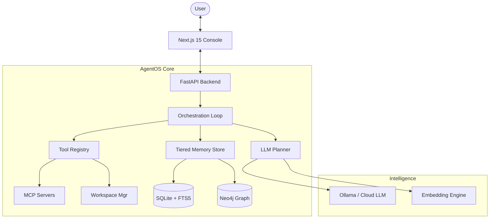

# 🌌 AgentOS: Precision Agent Orchestration & Observability


AgentOS is a high-performance orchestration framework designed for developers who need more than just a chat loop. It provides a robust, observability-first environment for building and debugging autonomous agents with multi-tiered memory, deep trace inspection, and modular tool integration.

---

## 🚀 Core Features

### 🧠 3-Tier Layered Memory
AgentOS manages memory across distinct tiers to ensure agents have the right context at the right time:
- **Working Memory**: Short-lived observations and scratch state (TTL-based).
- **Episodic Memory**: Verified task episodes tied to specific runs.
- **Semantic Memory**: Durable, verified facts and knowledge graph entities.
- **Experience Layer**: Learned success trajectories and failure avoidance patterns.

### 🔍 Deep Trace Observability
Every agent interaction is captured as a structured trace.
- **Trace Events**: `understand` ➔ `plan` ➔ `tool_call` ➔ `verify` ➔ `reflect`.
- **Score Annotation**: Automated evaluation of every step with verifier feedback.
- **Replay-Ready**: Every transition is logged with prompt versions and context IDs for offline debugging and RL training.

### 🛠️ Modular Tool Ecosystem
- **MCP Integration**: First-class support for the Model Context Protocol (MCP).
- **Hardened Workspace**: Safe, sandboxed file manipulation and local traversal.
- **Registry-First**: Adding new tools is as simple as defining a Python function with type hints.

### 💻 Modern Operator Console
A premium Next.js 15 dashboard built with Shadcn UI and Tailwind CSS for:
- Live chat and trace visualization.
- Semantic memory exploration.
- Detailed run evaluation and benchmarking.

---

## 🏗️ Architecture



---

## 🛠️ Setup Guide

### 1. Prerequisites
- **Python**: 3.10 or higher.
- **Node.js**: 18 or higher (for the frontend).
- **Ollama**: (Optional) For local LLM execution.

### 2. Backend Installation
```bash
# Create and activate virtual environment
python -m venv venv
source venv/bin/activate

# Install dependencies
pip install -e .
pip install -r backend/requirements.txt

# Configure environment
cp .env.example .env
# Edit .env with your LLM configuration
```

### 3. Frontend Installation
```bash
cd frontend
npm install
```

---

## 🏃 Getting Started

### Start the Backend
```bash
# From the root directory
venv/bin/python -m agentos.main
```

### Start the Frontend
```bash
cd frontend
npm run dev
```
The console will be available at `http://localhost:3000`.

---

## ⚖️ Evaluation & Benchmarking

AgentOS includes a built-in evaluation pipeline to measure agent performance across diverse tasks:
- **Slices**: Retrieval, Tool-use, Multi-step, Long-context, and Refusal-safety.
- **Metrics**: Success rate, tool precision/recall, context utility, and reflection ROI.
- **Ablations**: Test the impact of memory, planning, or reflection by toggling features in real-time.

---

## ⚙️ Key Environment Variables

| Variable | Default | Description |
|----------|---------|-------------|
| `AGENTOS_LLM_BACKEND` | `mock` | `mock` or `ollama` |
| `AGENTOS_DB_PATH` | `./data/agentos.db` | SQLite database path |
| `AGENTOS_MAX_STEPS` | `4` | Max iterations per task |
| `AGENTOS_ENABLE_MEMORY` | `true` | Toggle tiered memory system |
| `AGENTOS_ENABLE_OTEL` | `false` | Enable OpenTelemetry tracing |

---

## 📜 License
Personal project scaffolding. Adapt and build as you like.
